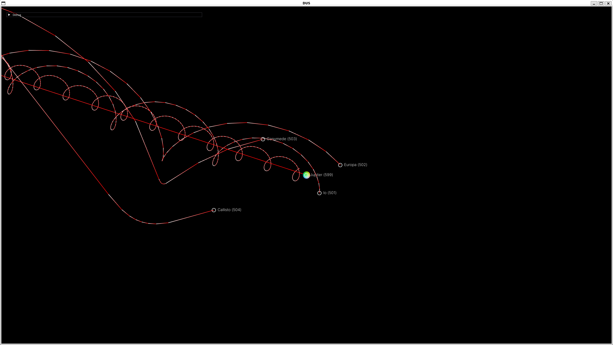

# Desktop Universe

An OpenGL project that can render REAL SIZE universe.

Now feature in:
- automatic data download & extract
- add more celestial use naif (on dev, directly add into `./data/tracking_bodies.json` works fine)
- showing trajectories
- change reference frame
- change focus body.

How to use:

## Compile

run:

```sh
./build.sh
./build/DUS
```

first time it will download position data from JPL, may takes a while. Each time download data for this and next month. In my repo, I uploaded Feb, Mar, Apr 2025 data, so you don't need to download them from JPL.

required package:

```
jsoncpp: https://github.com/open-source-parsers/jsoncpp
curl
OpenGL with glew glfw3
fmt: https://github.com/fmtlib/fmt
Eigen3: https://github.com/OPM/eigen3
```

Note:
- your OpenGL must support GLSL version 4.0 or higher. I use 4.3.
- wish your graphic card can handle fp64 calculation. ;) I haven't figure out how to compress into fp32.

## Thanks

celestial position data comes from: [JPL SSD](https://ssd.jpl.nasa.gov/)

GUI: [ImGui](https://github.com/ocornut/imgui) (directly included in my repo, for a release version 1.91.8, specific for glew+glfw3)

## Showcases

Jupiter System:

JCI:

SCI():

IO(Jupiter)-CI:
